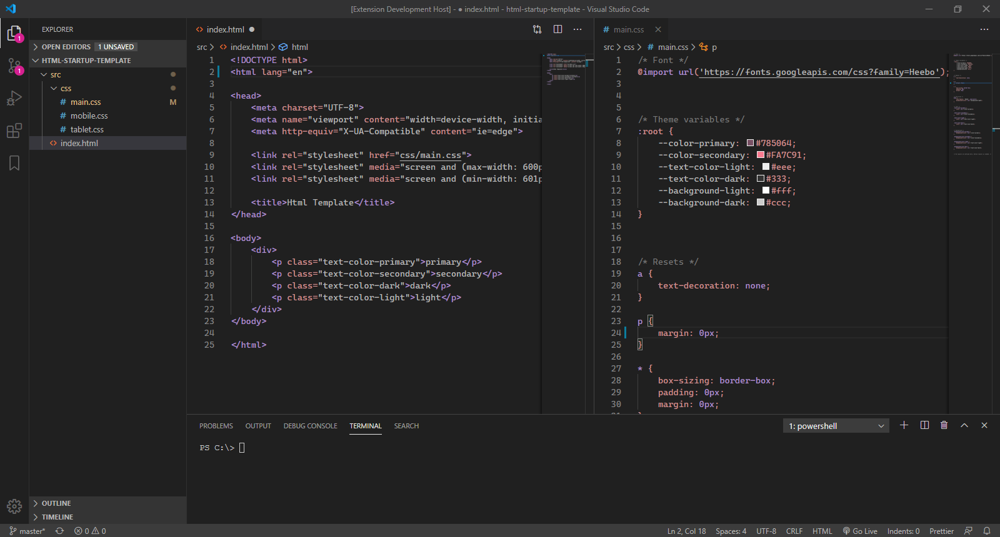
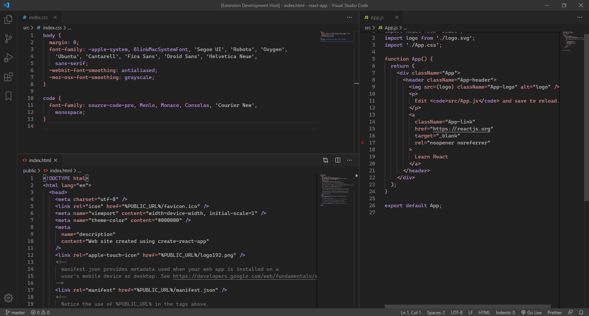

# Dark June

A minimal dark theme designed with soft colors, so hopefully you can focus on the code rather than getting distracted with too many bright colors.

It is inspired by the lovely [Dark Feminine Italics theme](https://marketplace.visualstudio.com/items?itemName=Charlotte.dark-feminine-italic).

## Screenshots

### Html and CSS

### React

## Installation

1. Open Visual Studio Code.
2. Open the **Extensions** sidebar panel and search for `Dark June`.
3. Click on the cog wheel and **Install** to install it.

